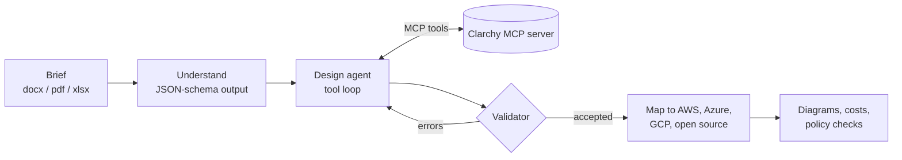

## Hi, I'm Namrata 👋

AI Engineer / Data Scientist at **Alstom** in Paris. I ship GenAI and agentic systems to production: RAG, LangGraph agents, and the evaluation and observability layer that decides whether a feature is ready to ship.

<p align="center">
  <picture><source media="(prefers-color-scheme: dark)" srcset="assets/pets.svg?v=headcat"></picture>
  <br><sub><code>$ ls ~/pets</code> · my rubber duck debugging team (Bishop debugs from my head)</sub>
</p>

```python
from dataclasses import dataclass

Stack = tuple[str, ...]


@dataclass(frozen=True)
class Engineer:
    name: str = "Namrata Bhatia"
    role: str = "AI Engineer / Data Scientist @ Alstom"
    based_in: str = "Paris, France"
    languages: Stack = ("Python", "SQL", "JavaScript")
    genai: Stack = ("RAG", "agents", "LangGraph", "LangChain", "tool calling")
    evaluation: Stack = ("ground truth", "LLM-as-a-judge", "A/B tests", "Langfuse")
    retrieval: Stack = ("embeddings", "rerankers", "Azure AI Search", "Elasticsearch")
    ml: Stack = ("PyTorch", "Hugging Face", "scikit-learn", "LightGBM", "spaCy")
    data: Stack = ("PostgreSQL", "Snowflake", "PySpark", "Dask", "Airflow")
    backend: Stack = ("FastAPI", "Azure Service Bus", "KEDA", "Docker", "CI/CD")
    cloud: Stack = ("Azure", "AWS")
    certified: Stack = ("AWS Cloud Practitioner", "AWS ML Practitioner", "Dataiku ML")
    interests: Stack = ("system design", "algorithms", "data", "open source")


me = Engineer()
```

### At work

- **RAG at scale:** a conversational assistant over 400,000 documents for about 1,000 engineers, with source citations on every answer and 3x faster indexing
- **Evaluation first:** built the team's GenAI evaluation practice (ground truth, regression tests, LLM-as-a-judge), raising accuracy from 65% to 90% on one workstream
- **Cost and speed:** model benchmarking and routing, semantic caching and context management cut processing of 10,000 records from a week to 10 minutes
- **Agents in production:** a LangGraph workflow integrated into IBM EWM, and an LLM document-quality engine in IBM DOORS that checks 21 INCOSE rules at about 80% accuracy

Also: MSc Data Science & AI (emlyon + McGill, GPA 4.0), part-time lecturer in AWS cloud and system design, and co-ambassador of Women in Data Science Paris.

### Currently building: [Clarchy](https://github.com/namratabhatia21/Clarchy) · [clarchy.com](https://clarchy.com)

Clarchy turns a requirements brief into a cloud architecture you can question, price and compare. Paste a brief or upload a Word, PDF or Excel file, and it designs the system and draws it for **AWS, Azure, Google Cloud and open source**, with the sentence from the brief behind every service, a cost estimate and the regulations that apply.



- An LLM agent designs through Clarchy's own MCP server, and its design is accepted only when a validator passes it
- Everything after the design (mapping, layout, pricing) is deterministic code, and a rule-based planner keeps it working with no model at all
- Runs on Claude or any OpenAI-compatible endpoint (Hugging Face, Ollama, vLLM); the live demo runs in the browser with Pyodide

### Why my contribution graph is quiet

```console
$ git log --author="Namrata" --all
warning: most of this history lives in private company repos
hint: the public log starts with Clarchy
```

<sub>[LinkedIn](https://www.linkedin.com/in/namratabhatia21)</sub>
