  <picture>
    <source media="(prefers-color-scheme: dark)" srcset="assets/hero-dark.svg">
    <source media="(prefers-color-scheme: light)" srcset="assets/hero-light.svg">
    
  </picture>

  

  
  

🧩 <b>Reveal the answer</b>

 
A <b>keyboard</b> ⌨️, Puzzle's favourite toy.

