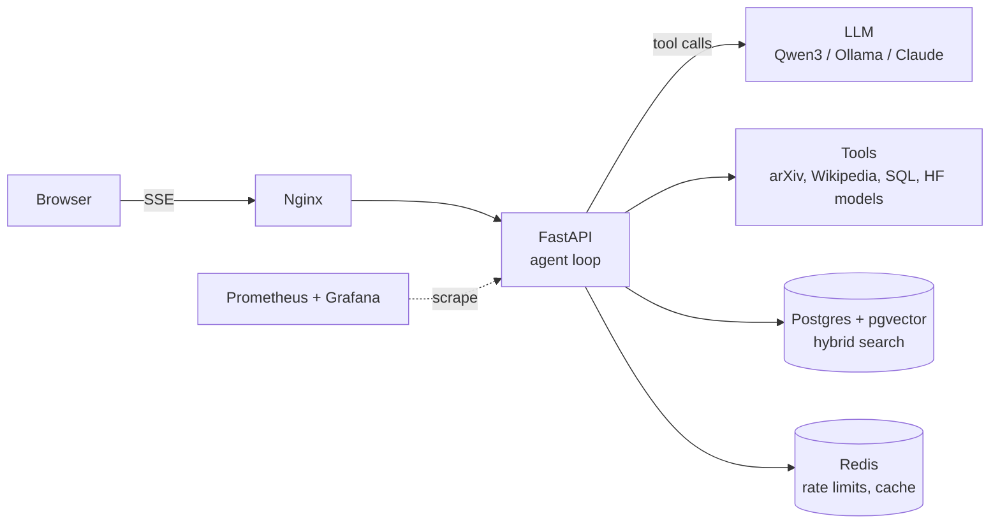
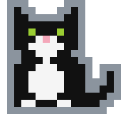

## Hi, I'm Namrata 👋

AI Engineer / Data Scientist. I build LLM agents and retrieval systems, and I'm happiest with a hard problem and a system design whiteboard.

```python
from dataclasses import dataclass

Stack = tuple[str, ...]


@dataclass(frozen=True)
class Engineer:
    name: str = "Namrata"
    role: str = "AI Engineer / Data Scientist"
    languages: Stack = ("Python", "SQL", "JavaScript", "TypeScript")
    ai_ml: Stack = ("LLM agents", "tool calling", "RAG", "embeddings", "Hugging Face")
    data: Stack = ("PostgreSQL", "pgvector", "Redis")
    backend: Stack = ("FastAPI", "Docker", "GitHub Actions", "Cloud Run")
    observability: Stack = ("Prometheus", "Grafana")
    interests: Stack = ("system design", "algorithms", "data", "open source")


me = Engineer()
```

### Currently building: [Agentic](https://github.com/namratabhatia21/Agentic)

A production-ready agentic chatbot that answers from live data. The model plans, calls tools in parallel, reads the results and cites its sources, streaming every step to the browser.



- Open-source LLMs by default, with Claude as an optional provider
- Hybrid retrieval: Hugging Face embeddings in pgvector fused with full-text search (reciprocal rank fusion)
- Typed tools with pydantic schemas, API keys, rate limiting, CI and a Cloud Run deploy script

### Why my contribution graph is quiet

```console
$ git log --author="Namrata" --all
warning: most of this history lives in private company repos
hint: the public log starts with Agentic
```

<p align="center">
  <picture><source media="(prefers-color-scheme: dark)" srcset="assets/tux-cat.svg"></picture>
  <br><sub><code>$ cat tuxedo.svg</code> · rubber duck debugging, tuxedo edition</sub>
</p>
